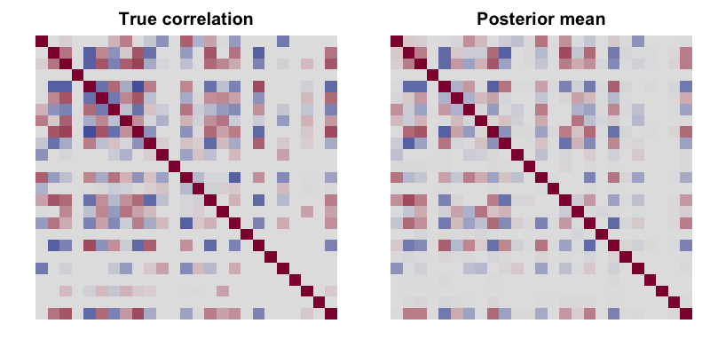

ZI-MLN: a simple simulation walkthrough
================

This short walkthrough fits the **ZI-MLN** model to one small, simulated
data set and checks that it recovers the truth. It focuses on the three
inputs new users ask about most: the count table `Y`, the subject index
`m`, and the number of subjects `M`.

``` r
# install.packages("remotes")
remotes::install_github("shuang-jie/ZI-MLN")
```

``` r
library(ZIMLN)
```

## The model inputs

`ZI_MLN(Y, X = NULL, m, M, ...)` takes:

| Input | Shape                     | Meaning                                                                                                                                                      |
|-------|---------------------------|--------------------------------------------------------------------------------------------------------------------------------------------------------------|
| `Y`   | `n x J` integer matrix    | The **count table**. Each **row is a sample**, each **column is an OTU/feature**. Raw counts — no normalization needed, and zeros are expected and modelled. |
| `m`   | length-`n` integer vector | The **subject index of each sample**: `m[i]` is the subject that sample `i` was taken from. Lets several samples share a subject (repeated measures).        |
| `M`   | single integer            | The **number of distinct subjects**, i.e. `length(unique(m))`. Defaults to that if omitted.                                                                  |
| `X`   | `n x P` matrix (optional) | Sample covariates. Leave `NULL` for the no-covariate model; supply it to estimate covariate effects `beta`.                                                  |

### Understanding `m` and `M`

`m` tells the model which samples came from the same subject, so it can
share a subject-level random effect between them. A couple of common
cases:

-   **One sample per subject** (the simplest): `m = 1:n` and `M = n`.
    Every sample is its own subject.
-   **Repeated measures**: e.g. 12 samples from 6 subjects, 2 samples
    each, would be `m = c(1, 1, 2, 2, 3, 3, 4, 4, 5, 5, 6, 6)` and
    `M = 6` — sample 1 and 2 share subject 1, samples 3 and 4 share
    subject 2, and so on.

The values in `m` are just labels `1, ..., M`; only which samples share
a label matters.

## Simulate a small data set

We use `simulate_zimln()` to draw a count table from the model itself,
together with the true parameters. Here we take **30 samples from
`M = 10` subjects, 3 samples each**, and `J = 25` OTUs.

``` r
M <- 10
m <- rep(1:M, each = 3)            # 3 samples per subject
m
#>  [1]  1  1  1  2  2  2  3  3  3  4  4  4  5  5  5  6  6  6  7  7  7  8  8  8  9
#> [26]  9  9 10 10 10
M
#> [1] 10

sim <- simulate_zimln(n = 30, J = 25, K = 3, zero.rate = 0.5,
                      M = M, m = m, seed = 8)

Y <- sim$Y
dim(Y)                             # 30 samples x 25 OTUs
#> [1] 30 25
Y[1:6, 1:8]                        # a corner of the count table
#>      [,1] [,2]  [,3] [,4]   [,5] [,6] [,7] [,8]
#> [1,]    2    3     0    0 283561    0   25   27
#> [2,]  626 3904 66142  185      1    0    1    0
#> [3,] 1184    1     3  194      0    0  401  411
#> [4,]    3    0     0  464      0    2    0    0
#> [5,]   23  501     0  468      0    0  178    0
#> [6,]   66    0    70  226  17226   60  249    0
mean(Y == 0)                       # fraction of zeros
#> [1] 0.3386667
```

Each row of `Y` is a sample; rows sharing a subject (e.g. rows 1-3) are
the repeated measures for that subject.

## Fit the model

With the inputs assembled, one call runs the MCMC sampler. We use a
fairly short chain here so the document knits quickly; for real analyses
use the defaults (`niter = 20000`).

``` r
fit <- ZI_MLN(Y, m = m, M = M, niter = 4000, burnin = 2000, seed = 7)
length(fit)                        # number of retained posterior draws
#> [1] 2000
```

`fit` is a list of posterior draws. The helper functions summarise it.

## Posterior summaries and recovery

**Marginal OTU correlations** `rho_jj'` — the model’s main target. We
compare the posterior mean to the truth on the off-diagonal entries:

``` r
rho_est <- posterior_correlation(fit)          # J x J matrix
ut <- upper.tri(rho_est)
cor(rho_est[ut], sim$true.cor[ut])             # agreement with the truth
#> [1] 0.9200584
```

<!-- -->

**Covariance** is available too — marginal `Omega` (default) or the
interaction covariance `Sigma = Lambda Lambda' + sigma^2 I`:

``` r
Sigma_est <- posterior_covariance(fit, marginal = FALSE)
dim(Sigma_est)
#> [1] 25 25
```

**Overall abundance** `r_i + alpha_j` (only the sum is identifiable) is
recovered from the draws:

``` r
rt_est <- Reduce(`+`, lapply(fit, function(d) outer(d$ri, d$thetaj, `+`))) / length(fit)
cor(c(rt_est), c(outer(sim$ri, sim$thetaj, `+`)))
#> [1] 0.9129447
```

## Adding covariates

To fit the covariate model, generate (or supply) an `n x P` matrix `X`
and pass it to `ZI_MLN()`. The covariate effects `beta_jp` then come
from `posterior_beta()`:

``` r
sim2 <- simulate_zimln(n = 30, J = 25, K = 3, p = 2, M = M, m = m, seed = 2)
fit2 <- ZI_MLN(sim2$Y, X = sim2$X, m = m, M = M,
               niter = 4000, burnin = 2000, seed = 7)

b <- posterior_beta(fit2)          # posterior mean + 95% intervals per (OTU, covariate)
head(b$table)
#>   otu covariate        mean      lower     upper
#> 1   1         1  2.14202518  1.3828074 2.9032894
#> 2   2         1 -0.27222727 -2.1216532 1.8974621
#> 3   3         1  1.89696470  0.9449871 2.7675769
#> 4   4         1  0.06490757 -0.9649924 1.0207503
#> 5   5         1  0.86200344  0.2206379 1.4699369
#> 6   6         1 -1.14063335 -2.5876168 0.4527981
cor(c(b$mean), c(sim2$beta))       # agreement with the true beta
#> [1] 0.9150468
```

Even with these short chains the estimates track the truth; longer
chains and larger data sets give the strong recovery reported in the
paper.
